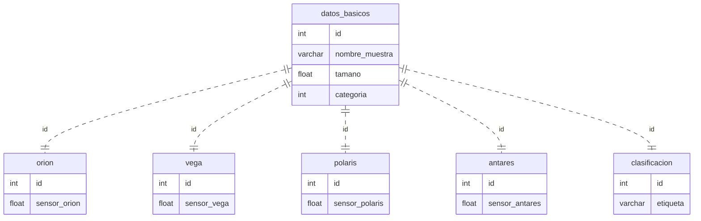

# Taller Práctico para Clasificación de Datos. Algoritmos de Machine Learning.

Este es un taller donde se disponen datos en una base sqlite (.db) y se debe entrenar un modelo de machine learning para clasificar unos datos faltantes.

## Instrucciones
Eres un analista de datos que inicia trabajo para una organización de trabajo secreto/confidencial.

Esta organización/empresa trabaja con mediciones espaciales de "muestras" por medio de satelites en orbita. Ellos tienen una base de datos con mediciones de diferentes satelites y quieren que se haga un modelo de machine learning que pueda clasificar los datos faltantes de una de las mediciones.

En orbita se encuentran 4 satelites

1. orion
2. vega
3. polaris
4. antares

Cada uno de estos satelites hace una medición numerica (por temas de seguridad ocultaremos el significado fisico de estas mediciones) y se guardan en una base de datos sqlite (.db). [**datos_sensores.db**](./datos_sensores.db)

la base de datos tiene 4 tablas.

________________________________________________________
Nombre Tabla: **datos_basicos**

Esta tabla contiene los datos basicos de cada muestra

* **id**: identificador unico de la muestra
* **nombre_muestra**: nombre de la muestra
* **tamaño**: tamaño de la muestra en metros
* **categoria**: categoria de la muestra, posibles valores (1,2,3)
________________________________________________________

Nombre Tabla: **orion**

En esta tabla se registraron las mediciones del satelite orion

* **id**: identificador unico de la muestra
* **sensor_orion**: medicion del satelite orion

________________________________________________________

Nombre Tabla: **vega**

En esta tabla se registraron las mediciones del satelite vega

* **id**: identificador unico de la muestra
* **sensor_vega**: medicion del satelite vega

________________________________________________________

Nombre Tabla: **polaris**

En esta tabla se registraron las mediciones del satelite polaris

* **id**: identificador unico de la muestra
* **sensor_polaris**: medicion del satelite polaris

________________________________________________________

Nombre Tabla: **antares**

En esta tabla se registraron las mediciones del satelite antares

* **id**: identificador unico de la muestra
* **sensor_antares**: medicion del satelite antares

________________________________________________________

Nombre Tabla: **clasificacion**

En esta tabla se registraron las clasificaciones de las muestras. Aqui existes 100 datos faltantes que se deben clasificar con un modelo de machine learning.
* **id**: identificador unico de la muestra
* **etiqueta**: etiqueta de clasificacion de la muestra, posibles valores (Positivo, Negativo)

## Diagrama de la base de datos.

## Objetivo de la misión

- [ ] Generar un repositorio en Github con un análisis exploratorio de los datos. EDA.
    - [ ] Crear un _readme.md_ con la descripción del trabajo realizado. Con Título, objetivos, descripción, resultados y conclusiones. Apoyarse de imagenes, tablas, etc. Este readme es el informe que pasará a la organización/empresa.
    - [ ] El repositorio debe estar ordenado con carpetas y archivos. Ej: carpeta de notebooks, carpeta de imagenes, etc.
- [ ] Entrenar un modelo de machine learning que pueda clasificar los datos faltantes de la columna **etiqueta** de la tabla **clasificacion**.
- [ ] En una carpeta que se llame "output" dejar un csv con el nombre **predicciones.csv** con las clasificaciones hechas con el modelo. Este archivo debe tener 2 columnas, la columna **id** y la columna **etiqueta**.

    NOTA: Solo debe enviar los *100* registros que **NO** tienen etiqueta en la base de datos.
    - [ ] La columna etiqueta debe tener solo 2 valores posibles (Positivo, Negativo)